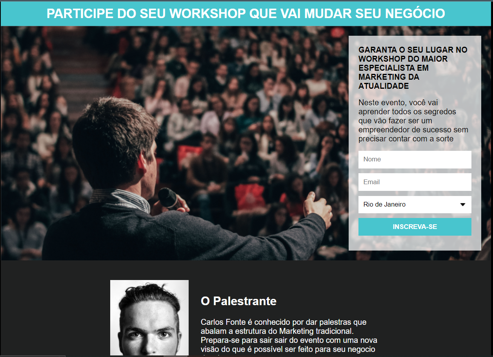

# Projeto Workshop 
### Projeto para se inscrever no workshop com e-mail, nome e cidade.
### <b>(Palestrante fictício)</b>

 

 

### <b>Pagina de captura</b>, para as pessoas que tenham interesse em inscrever-se e receber atualizações sobre, o provedor conseguirá enviar um e-mail para todos os usuários cadastrados simultaneamente
  

## Integrado o Mailchimp 
### Receber dados que o usuário cadastrou, assim, o provedor pode enviar um e-mail para todos.

 

---
## Nesse projeto usei:
- HTML
- CSS
- Mailchimp

 

### (Meu Primeiro Projeto :)